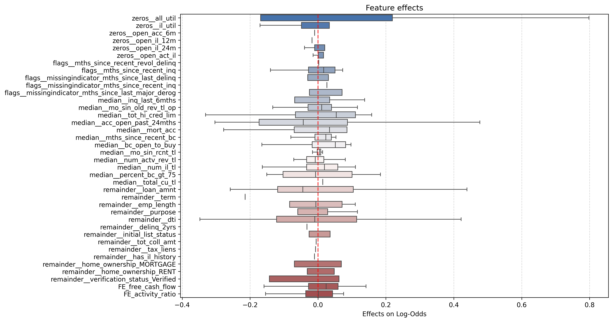
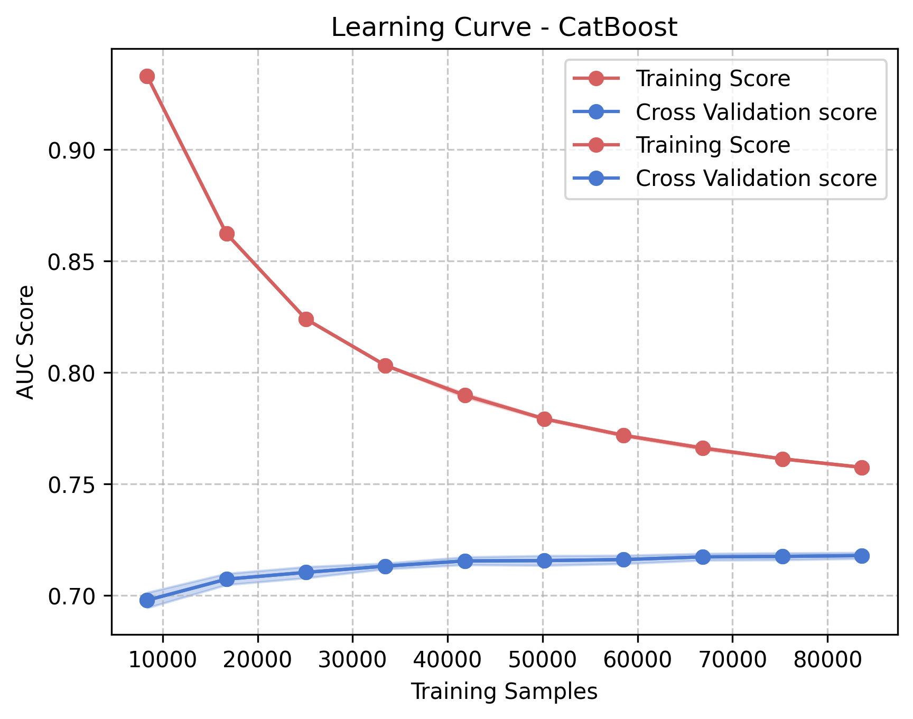
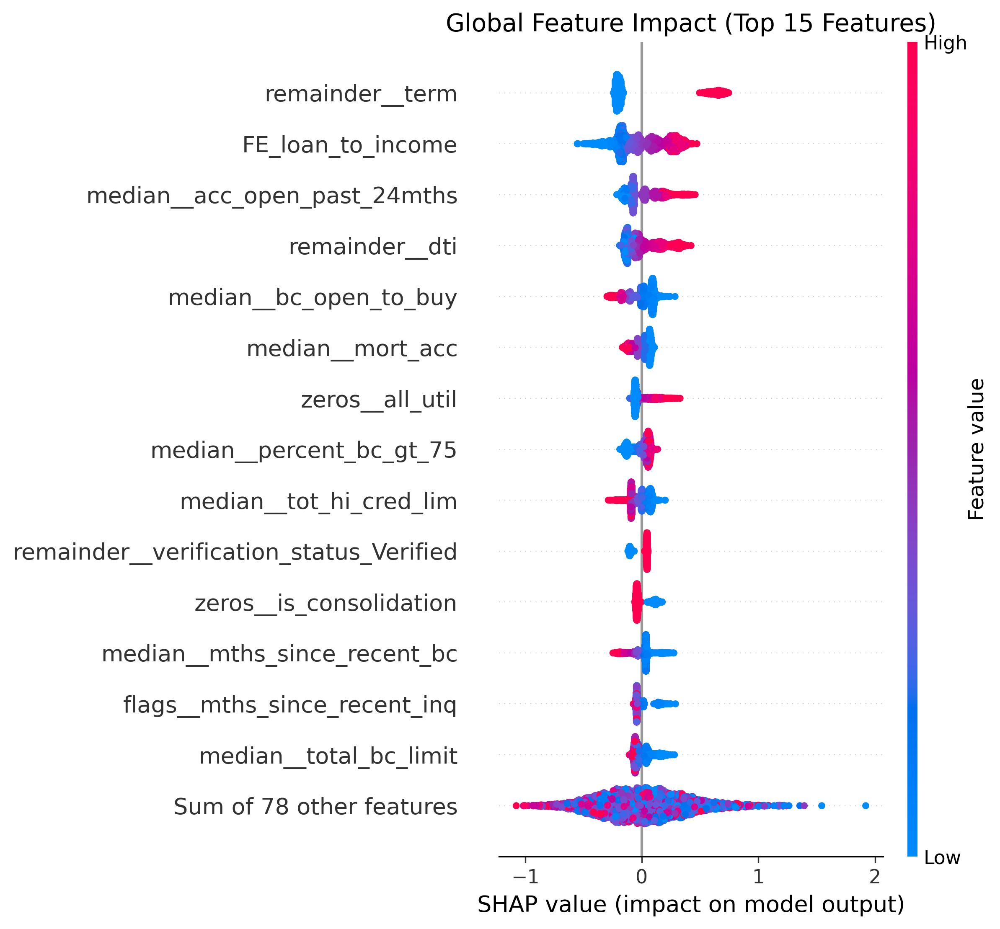

# Applied Data Analysis & Statistical Modeling Projects

This repository contains an applied (end-to-end) project demonstrating SQL data 
pulling/cleaning, statistical reasoning, feature engineering, inference modelling, 
model diagnostics and interpretation of a real world dataset. Drawing on my 
background in mathematics, statistics, and finance, this project applies Python 
and machine learning techniques with an emphasis on interpretability and 
business impact.

The project culminates in a simulated A/B test comparing the industry standard 
decision threshold (0.5) against a data driven optimized threshold (0.213), 
using a held-out 90% of the dataset as the test population. The goal is to 
quantify the real world net value of threshold optimization in a credit 
risk context.

---
## 1. Credit Card Default Risk Modeling

### Objective
Develop and compare classification models for credit default prediction, with emphasis on:
- Proper handling of class imbalance
- Feature diagnostics and multicollinearity control
- Threshold optimization for decision-making
- Out-of-sample validation
- Interpretability in a risk management context

### Dataset
- [Lending Club Loan Data](https://www.kaggle.com/datasets/adarshsng/lending-club-loan-data-csv) 
- Real world data from 2020.
- This company is a peer-to-peer lending corp based in the US that is currently active.

### Initial Data Engineering & Feature Pruning (SQL Pipeline)

Preprocessing was conducted in SQL prior to modeling.

- Reduced dataset from **144 columns → 91 columns**
- Removed redundant and post loan outcome leakage variables  
- Documented rationale for each decision

Full SQL workflow can be checked here with details on every step: [SQL](https://github.com/Mbu32/Data-Analysis/tree/a5d0f93a8ba6a3a7d62020c47d289a1080efbb36/SQL)

## Logistic Regression &  Baseline

Before moving to complex non-linear models, I established a baseline using Logistic Regression. This phase focused on: handling extreme outliers (Winsorization at the 1st and 99th percentiles), addressing multicollinearity, and optimizing the solver with ElasticNet regularization.

### Model Performance with 5 Fold Cross-Validation

The model was tuned using Optuna to find the optimal balance of L1 and L2 penalties ($l1\_{ratio} \approx 0.69$). I had a significantly low standard deviation, suggesting the model has generalized decently well.

| Fold 1 | Fold 2 | Fold 3 | Fold 4 | Fold 5 |
| :--- | :--- | :--- | :--- | :--- |
| 0.6995 | 0.7066 | 0.7008 | 0.7039 | 0.7025 |

> **Mean AUC:** `0.7026`  
> **Standard Deviation:** `0.0024`

---

### Key Risk Drivers:

By combining **Cohen’s d** (effect size) and **Mean Difference**, we show the typical profile of a defaulter vs. a successful borrower.

* **Loan Term:** On average, borrowers who default select terms **4.4 months longer** than those who pay back. Longer exposure directly correlates with higher default probability.
* **Debt-to-Income (DTI) Ratio:** Defaulters carry a DTI that is **2.27 points higher**. This tells us that they are financially stretched thin before the loan even begins.
* **Total High Credit Limit:** Borrowers who successfully repay have on average **~$30,150** MORE in total high credit limits. 

---

###  Effect Plot

I've added the Effect plot to show priority our model put on features rather than the univariate metrics like above. By looking at the distribution below, we can see model placing more emphasis on features like:

* `all_util`,  `acc_open_past_24mths`, `loan_amnt`, and `dti` show broad whiskers. This indicates they are the primary drivers of individual risk scores which shifts a borrower significantly toward or away from default based on their specific values.
* While `term` had a massive Cohen's d and weight, it's actual impact in the effect plot is shown by a tight and discrete line this is because it is categorical and its effect is more all or nothing rather than a continuous line.

---

For a more detailed breakdown of all steps taken and all logic behind steps, **[Full Logistic Regression Breakdown →](/LogisticRegression/ReadMe.md)**

---

## Second Phase — CatBoost (Non-Linear Tree Ensemble)

To capture non-linear patterns and feature interactions that logistic regression cannot model, I used a CatBoost classifier. Rather than applying VIF or linear feature selection upfront, all features were retained and SHAP values were used post training to find and prune out non-performing features.

### Model Selection & Tuning

Three gradient boosting models were benchmarked via 3-fold stratified cross-validation:

| Model | Mean AUC |
| :--- | :--- |
| CatBoost | 0.703 |
| LightGBM | 0.700 |
| XGBoost | 0.698 |

CatBoost was selected and hypertuned via Optuna (50 trials) with early stopping, giving us a final cross-validated AUC of **0.718**.

### Learning Curve & Weight Plot

Slight overfitting observed (train ~0.76, CV ~0.72) with both curves plateauing, additional data would not improve performance.

Each dot represents one borrower. Position on the x-axis shows how much that feature pushed the prediction toward default (right) or away (left). Color indicates whether the feature value was high (red) or low (blue).

### Threshold Optimization

Rather than using the default 0.5 threshold, an expected value framework was applied using actual loan amounts and interest rates from the dataset.

| Threshold | Precision | Recall | F1 | Flagged |
| :--- | :--- | :--- | :--- | :--- |
| 0.213 | 0.340 | 0.619 | 0.439 | 36.6% |
| 0.250 | 0.369 | 0.513 | 0.429 | 27.9% |
| 0.300 | 0.415 | 0.392 | 0.403 | 19.0% |
| 0.500 | 0.572 | 0.091 | 0.157 | 3.2% |

| Threshold | Net Value |
| :--- | :--- |
| 0.213 | $105,678,761 |
| 0.300 | $74,264,002 |
| 0.500 | $3,579,880 |

> The optimal threshold of **0.213** produces **26x more net value** than the standard 0.5, by prioritizing defaulter detection over false alarm minimization.

> Depending on review capacity, 0.300 (19% flagged, $74M net value) may be more practical to use.

### SHAP Interpretability

Feature importance was validated through SHAP analysis, confirming that top features act as **independent signals** (dendrogram distances > 0.2) with clear non-linear relationships, particularly `median__bc_util` which shows near-zero impact below 80% utilization followed by a sharp risk spike.

### Test Set Results — Threshold 0.213

| Metric | No Default | Default |
| :--- | :--- | :--- |
| Precision | 0.88 | 0.34 |
| Recall | 0.69 | 0.62 |
| F1 | 0.78 | 0.44 |

The model catches **62% of defaulters** on unseen data. When approving a borrower, the model is correct **88% of the time**. 

**[Full CatBoost Breakdown →](/TreeModels/ReadMe.md)**

---

## Model Comparison

| Model | CV AUC | Test AUC | Generalization Gap |
| :--- | :--- | :--- | :--- |
| Logistic Regression | 0.7026 | 0.697 | 0.005 |
| CatBoost | 0.722 | 0.720 | 0.002 |

CatBoost outperforms the logistic regression baseline by **+0.023 AUC**, with the additional benefit of capturing non-linear patterns and providing SHAP based interpretability suitable for a risk management context. A test AUC difference of 0.002 confirms strong generalization.

---

## A/B Test Results — Threshold Optimization on Holdout Data (90%)

The simulation compares two lending policies applied to **1,175,938 holdout applicants**:
- **Control**: Industry standard threshold (0.5)  
- **Treatment**: optimal threshold (0.213)

---

### Financial Impact

| Metric | Control (0.5) | Treatment (0.213) | Difference |
| :--- | ---: | ---: | ---: |
| Net Value | $206,844,882 | $1,201,893,638 | **+$995,048,756** |
| Expected Gain | $2,006,382,597 | $2,503,906,975 | +$497,524,378 |
| Expected Loss | $1,799,537,714 | $1,302,013,336 | -$497,524,378 |

> Optimizing the decision threshold alone, without changing the model produces a **5.8x improvement** in net value (LIFT).

---

### Risk & Operational Metrics

| Metric | Control (0.5) | Treatment (0.213) |
| :--- | ---: | ---: |
| Recall (defaulters caught) | 14.6% | 69.6% |
| Precision (flags that are real defaults) | 52.0% | 31.2% |
| Applications Flagged | 5.7% | 44.8% |
| Default Rate in Approved Loans | 18.2% | 11.1% |

---

### Key Takeaways

- The control policy misses **85%** of bad loans
- The treatment policy catches **70%** at the cost of a higher flag rate
- Default rate in approved loans drops from **18.2% → 11.1%** — the most operationally meaningful metric for a lender
- The **44.8% flag rate** is our operational constraint 

> **Note:** Assumptions used — Loss Given Default: 60% of loan amount, 
> opportunity cost of false positives: average interest revenue per loan. 
> All figures are simulated on held out data the model never saw during training.