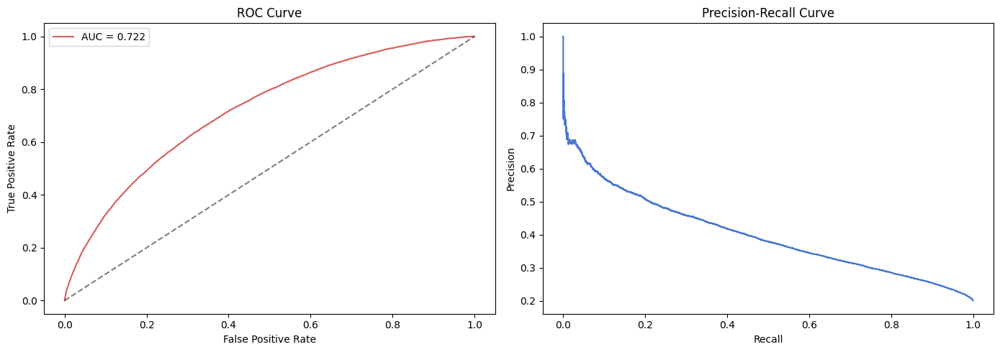

#  Non-Linear models

This part of the project attempts to maximize accuracy by finding patterns and interactions that can be found in non linear methods like tree ensemble unlike our logistic regression that was our baseline.

---
### Preprocessing

I kept the same preprocessing except when it came to dropping columns. We used VIF and univariate methods to find significance/non-signficance with features but these were simply linear methods. I chose to keep all columns and let our tree model do the work and then plotting SHAP values and other methods listed later to ascertain whether or not we will drop features or not!

---

### Base models + hypertune and Learning Curve

To begin, we placed three models XGboost, LGBM, and lastly Catboost (tree based models) and cross validate their scored with 3 stratified folds. CatBoost had the highest average AUC with 0.703.

We then moved on to Hypertune our base model via Optuna and then finished off with a Learning Curve

What we can see is that our model definitely has some slight overfitting where the gap of our training curve is sitting at ~0.76 and CV sitting at ~0.72, both curves have also flattened at the end so that tells us that more data won't be helping out.

The model still performs generally well considering human patterns can be extremely hard to predict.

As a sidenote, comparing to other models on Kaggle, I was concerned maybe I was missing out on something but nope, my models pretty close to top models without using ANN's.

---

### Finding Optimal Threshold

Through these plots we can see how our training data performs and attempt to visualize a best case threshold

after calculating the arg max best F1 we found a threshold of 0.206 to be most optimal where:

| Threshold     | Precision     | Recall        | F1           | 
| :--- | :--- | :--- | :--- | 
|0.190|        0.318|        0.684|        0.434|       
|0.206|        0.332 |       0.637  |      0.437   |    
|0.250|        0.369  |      0.513    |    0.429      | 
|0.300|        0.415   |     0.392      |  0.403| 
|0.350 |       0.457 |       0.289 |       0.354 |      
|0.400  |      0.499   |     0.207    |    0.293     |  
|0.500  |      0.572    |    0.091      |  0.157 | 