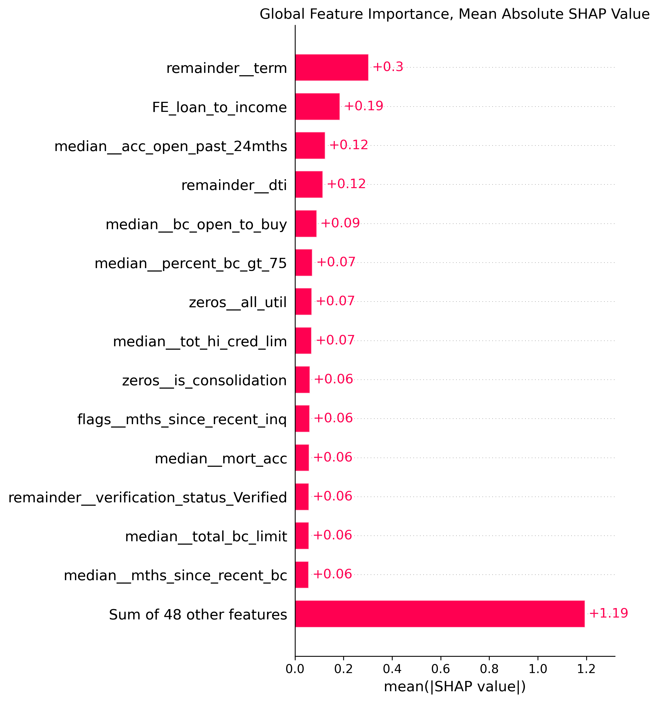
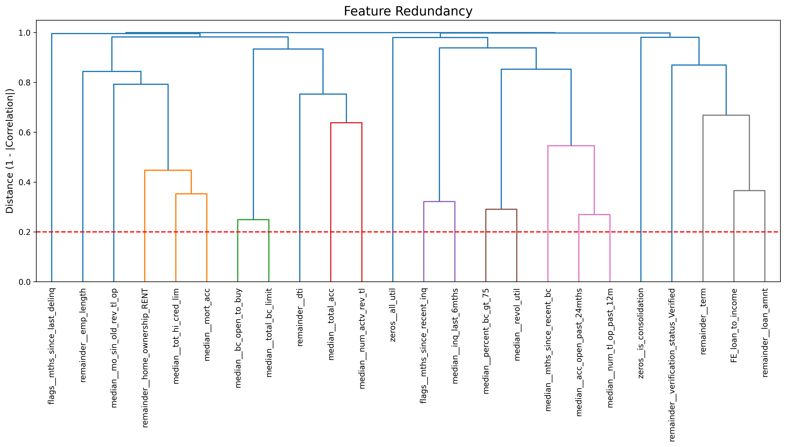
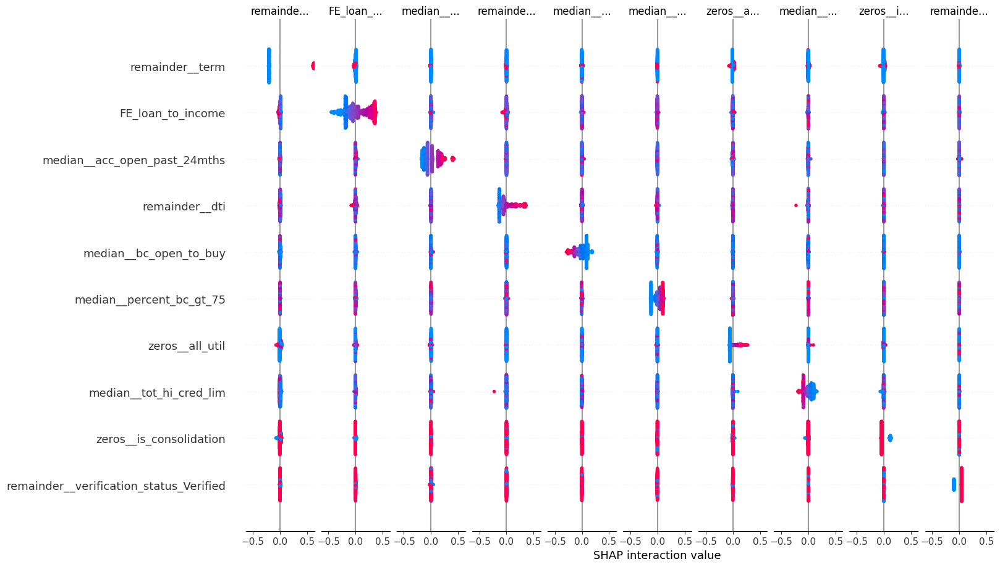
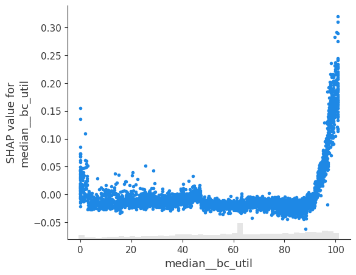
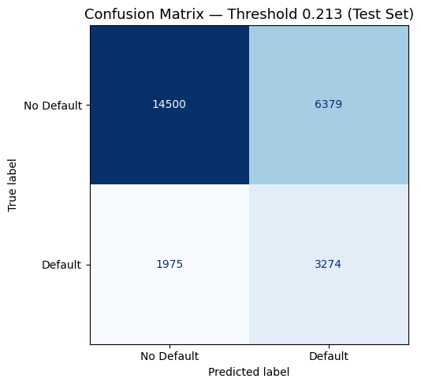
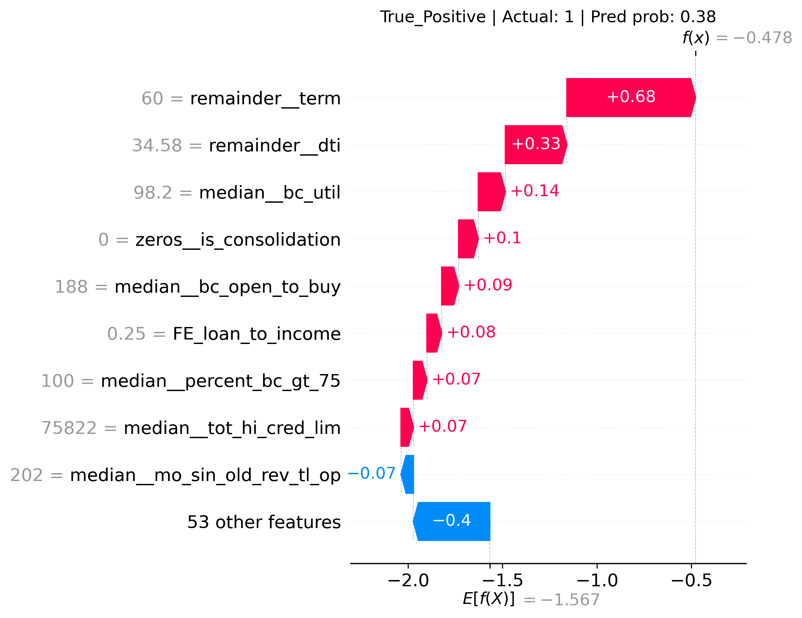
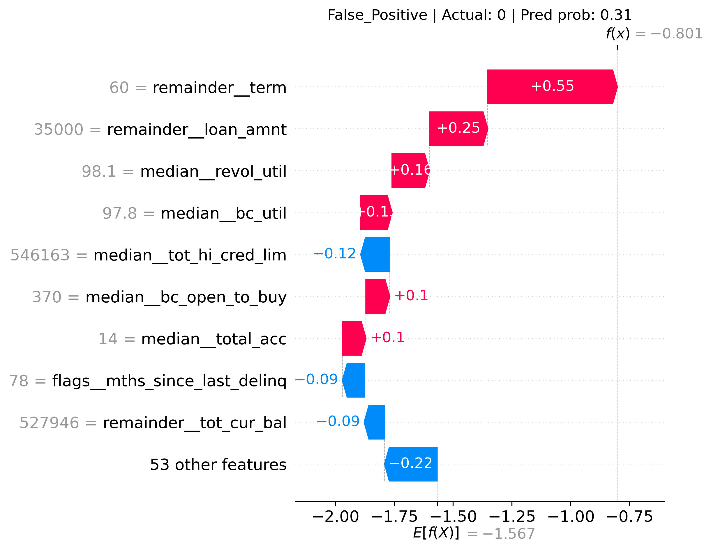
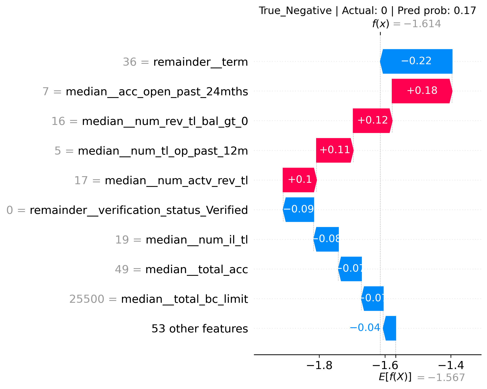
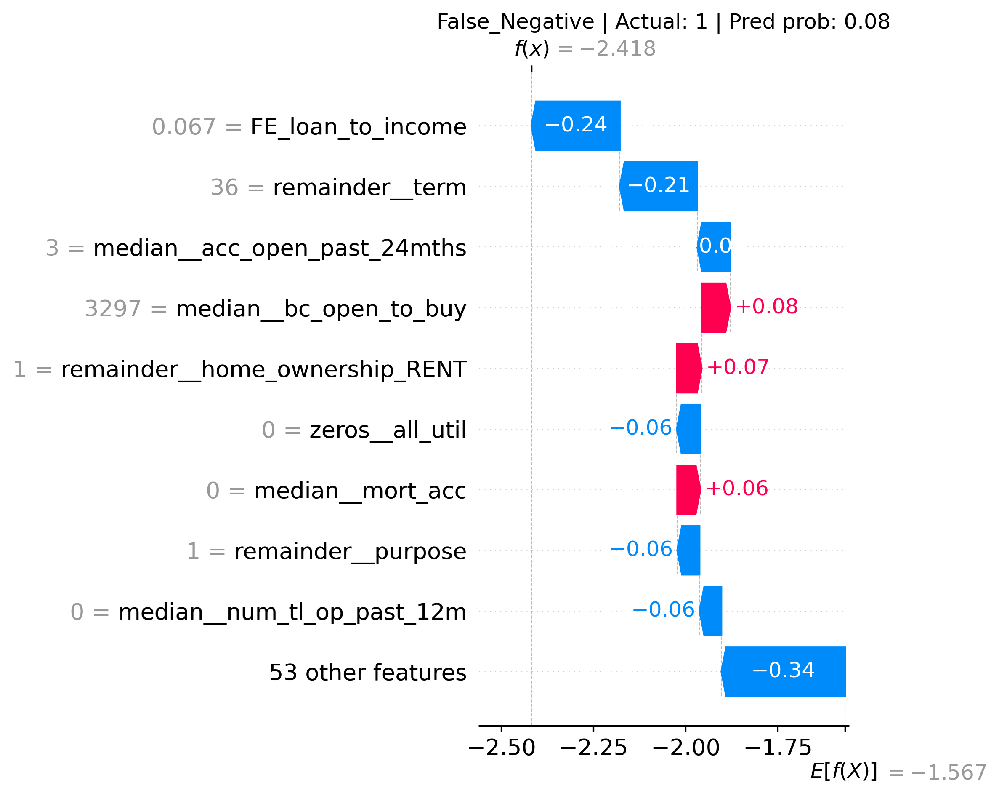

#  Non-Linear models

This part of the project attempts to maximize accuracy by finding patterns and interactions that can be found in non linear methods like tree ensemble unlike our logistic regression that was our baseline.

---
### Preprocessing

For this phase, I adjusted my feature selection. In the linear baseline, we used VIF and univariate methods to drop highly collinear or linearly insignificant features. We now shift because tree based models natively handle collinearity and discover non-linear relationships, I chose to instead to model a wider feature set. I'll let the algorithm do the heavy lifting, and then use SHAP (Shapley Additive Explanations) post-training to prune unhelpful features.

---

### Base models + hypertune and Learning Curve

To establish our new baseline, I placed three models XGboost, LGBM, and lastly Catboost (tree based models) and cross validate their scored with 3 stratified folds. CatBoost had the highest average AUC with 0.703.

After selecting CatBoost, I optimized its hyperparameters using Optuna and plotted a Learning Curve to check for data saturation and overfitting:

Observations: The model exhibits slight overfitting, with the training curve falling around ~0.76 AUC and the cross-validation curve at ~0.72 AUC. Both curves have flattened out, telling us that simply adding more training data of the same type will not significantly improve performance. Given the high degree of noise that can undoubtedly be found in real world data, our performance aligns closely with other benchmarks for this dataset without resorting to more complex methods (ANN's).

Comparable tries with this dataset can be found on [here](https://www.kaggle.com/code/faressayah/lending-club-loan-defaulters-prediction)

---

### Finding Optimal Threshold

A model's raw probability is useful if we know exactly where to draw the line between our decisions, that being to approve or deny applicants. I mapped the model's performance across these thresholds (as well as use our argmax function) to find optial cutoff:

| Threshold| Precision| Recall| F1| Amount Flagged| Percentage Flagged
| :--- | :--- | :--- | :--- | :--- | :---|
|0.190|        0.318|        0.684|        0.434|45,153|43.2% of applicants  |     
|0.213|        0.340 |       0.619  |      0.439|40,267|36.6% of applicants |
|0.250|        0.369  |      0.513    |    0.429|29,169|27.9% of applicants|
|0.300|        0.415   |     0.392      |  0.403|19,839|19.0% of applicants |
|0.350 |       0.457 |       0.289 |       0.354|13,281|12.7% of applicants  |   
|0.400  |      0.499   |     0.207    |    0.293|8,720|8.3% of applicants   |
|0.500  |      0.572    |    0.091      |  0.157|3,333|3.2% of applicants  |

While **0.213** is the mathematical optimum score for F1, metric don't tell us the whole story so I translated that to dollar values and show their financial impact:

|Threshold |   Expected Loss |       Expected Gain   |     Net Value |          
| :--- | :--- | :--- | :--- |
|0.190 |       $115,222,627  |       $223,082,557  |       $107,859,930|        
|0.213 |       $116,406,212  |       $221,991,973  |       $105,678,761|        
|0.250 |       $122,902,276  |       $215,402,909  |       $92,500,634 |        
|0.300 |       $132,020,591  |       $206,284,593  |       $74,264,002 |        
|0.350 |       $142,279,452  |       $196,025,733  |       $53,746,281 |        
|0.400 |       $151,831,294  |       $186,473,891  |       $34,642,597 |        
|0.500 |       $167,362,652  |       $170,942,532  |       $3,579,880  |

While 0.213 maximizes F1 and net value, it flags 36.6% of applicants. Depending on actual capacity, 0.300 (19% flagged, $74M net value) might be more realistic.

> **Assumptions**  
- Loss Given Default: 60% of loan amount
- Lost interest revenue: average loan x average interest rate
- These are estimates, actual Losses will vary of course 

---

### Interpretations of our Model using SHAP

To determine which features drove the model's predictions on a global scale, I calculated the Mean Absolute SHAP values across the dataset. The SHAP values represent the impact of a feature on the model's output in log-odds. I also pruned out 28 features that we're not contributing, after rerunning our model (with cross validation) we saw a ~0.001 drop in AUC, not a bad deal!

Bar Plot of mean Absolute SHAP Values

Key Drivers of Default Risk:

Loan Term (remainder__term): This is by far the strongest feature. On average, the length of the loan swung the model's prediction by 0.3 log-odds. In credit risk, a 60-month term inherently carries much more uncertainty than a 36-month term, and the model heavily relied on it!

Debt-to-Income Dynamics (FE_loan_to_income & remainder__dti): The custom feature I engineered (FE_loan_to_income) outperformed the base DTI metric, this is a good proof that our feature engineering was fruitful! Together, a borrower's raw capacity to take on more debt was definitely  a strong predictor.

Recent Credit Seeking (median__acc_open_past_24mths): The model assigns significant weight to how many new accounts a borrower opened in the last two years. A sudden spike in new credit lines is an indicator of financial distress.

An extra plot:

It shows three things at once: Importance (Y-axis), magnitude (X-axis), and Directionality (Color). It proves that High (red) Terms lead to Positive (risky) SHAP values.

## A quick check on correlation between features:

Tree models can split importance between highly correlated variables. To make sure our SHAP values were representing true feature impact, I plotted a hierarchical clustering dendrogram.

The clustering confirms that the majority of our strongest predictive features are highly independent of each other. While a few lower-tier features showed correlations closer to 75%, our primary features are independent!!!!!!!!!

---

### Interaction Terms & non-linear patterns

A quick glance at how features are interacting shows that there are very weak interactions for our top 10 features.

However, we can now show why we chose non linear methods and its for this reason:

As you can see, a pure linear model would NOT catch a pattern like this. We can see how Bank Card utility is being assessed by our model, those with high (85%>) card utility (median__bc_util) had a significantly higher risk to them than those below that region and we can again see higher risk with those with no utility as well.

---

### Verifying on Test Data

Running our pruned and tuned (did you like the rhyme there - ahem ahem anyway) model we saw:

| Test AUC | Train AUC (CV)| Difference|
| :--- | :--- | :--- |
|0.719|0.722| 0.003|

I think I would call this a success, with unseen data our model generalized very well compared to our training data and gives us an almost identical AUC!

A better view of this would be to look at our actual results via a Confusion Matrix:

With our optimal Threshold of 0.213

| Metric | No Default | Default |
| :--- | :--- | :--- |
| Precision | 0.88 | 0.33 |
| Recall | 0.67 | 0.64 |
| F1 | 0.76 | 0.44 |

The model catches **64% of defaulters** on  unseen data.

The low default precision (0.33) is expected at this threshold — we are 
purposely being as wide as possible to prioritize catching defaulters over 
minimizing false alarms. This tradeoff is reflected in the expected value 
analysis, where threshold 0.206 still produces the highest net value despite 
the higher false positive rate.

When the model approves a borrower (predicts no default), it is correct 
88% of the time — meaning approved loans carry low risk.

To show this tradeoff:

|Threshold  |  Expected Loss |       Expected Gain     |   Net Value|           
|:---|:---|:---|:---|
|0.190|$28,813,505          |$55,626,474   |       $26,812,969|         
|0.206|$29,120,272          |$55,319,707   |       $26,199,435|         
|0.300|$33,514,824          |$50,925,154   |       $17,410,330|         
|0.400|$38,123,641          |$46,316,337   |       $8,192,696 |         
|0.500|$41,720,354          |$42,719,625   |       $999,271 |

At the industry standard threshold of 0.50, net value drops to just $999,271, 
compared to $26.2M at our optimal threshold of 0.206. This represents a much bigger improvement in net value through threshold optimization alone, without changing the model at all.

> **Note**: Expected value figures reflect the test set only (~26k applicants). 

### Individual Predictions — 

To understand *why* the model makes specific decisions, we examine one individual 
from each prediction category:

---

**True Positive | Actual: Default | Pred prob: 0.38**

Correctly flagged defaulter. Key risk drivers: 60-month term (+0.68), high DTI 
of 34.58 (+0.33), and near-maximal BC utilization of 98.2% (+0.14). A textbook 
high-risk profile the model correctly identified despite the "53 other features" 
pushing back (-0.40).

---

**False Positive | Actual: No Default | Pred prob: 0.31**

Wrongly flagged good borrower. The model was fooled by a 60-month term (+0.55), 
large loan amount of $35,000 (+0.25), and extremely high revolving utilization 
of 98.1% (+0.16). On paper this person looks nearly identical to a defaulter — 
the model had no observable signal to distinguish them. This represents the 
core precision/recall tradeoff at threshold 0.206.

---

**True Negative | Actual: No Default | Pred prob: 0.17**

Correctly approved borrower. The 36-month term pushed strongly toward safe 
(-0.22) and the "53 other features" collectively agreed (-0.04). Note that 
`median__acc_open_past_24mths = 7` pushed toward risk (+0.18) but was 
overwhelmed by the safe signals — the model correctly read the full picture.

---

**False Negative | Actual: Default | Pred prob: 0.08**

Most critical case — a missed defaulter. Despite being a real defaulter, 
the model assigned only 0.08 probability. The low loan-to-income ratio 
(-0.24) and 36-month term (-0.21) dominated, masking the true risk. 
The "53 other features" also pushed strongly toward safe (-0.34). 
This borrower had a deceptively safe-looking profile — illustrating 
why even an optimized threshold cannot catch all defaults.

> **Key takeaway:** The False Negative case highlights the fundamental 
> limit of any model — some defaulters are indistinguishable from safe 
> borrowers based on available features alone. This reinforces the value 
> of threshold optimization: by lowering to 0.206, we catch more of these 
> borderline cases at the cost of some false alarms.